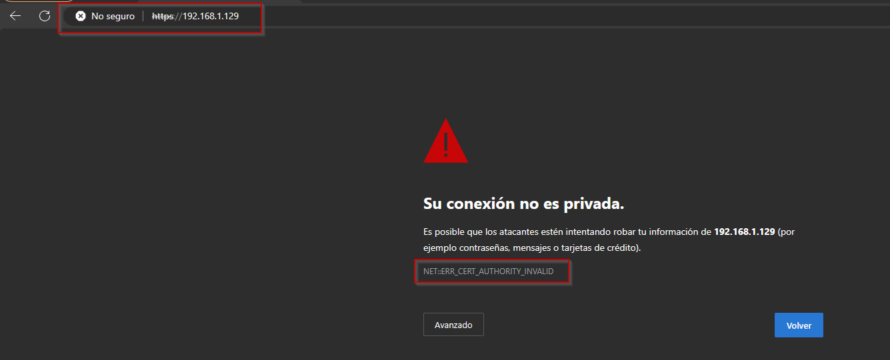
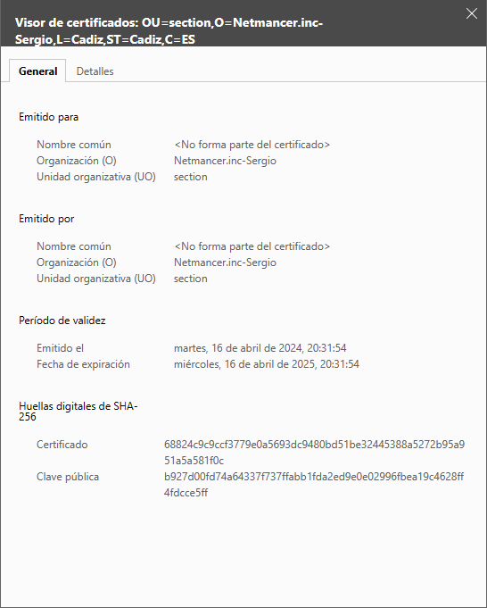
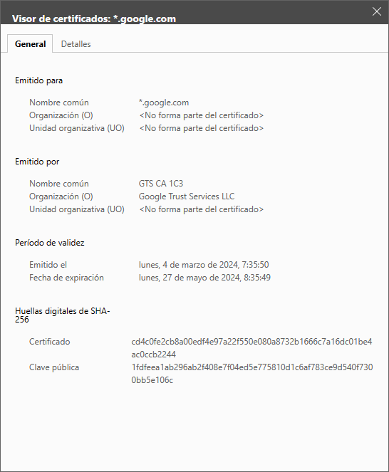
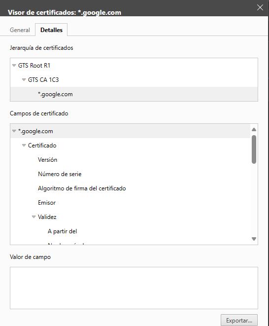
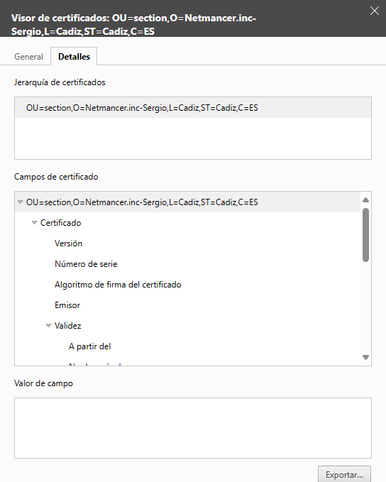
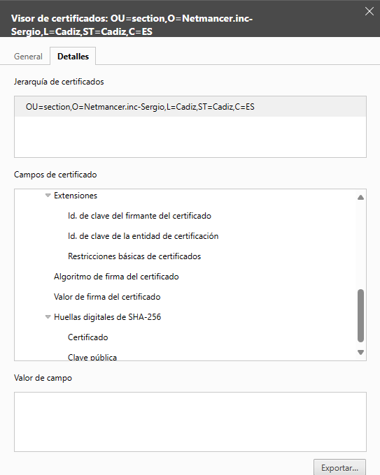

# Parte 2 Certificados Digitales - Sergio Guerrero Merlo

## Error proporcionado por el navegador

Una vez he creado el servidor web con un certificado autofirmado y el HTTPS configurado, he accedido a través del navegador para comprobar el error dado.

## Comparación de certificado autofirmado y el certificado de Youtube

El certificado que hemos generado nos ha pedido al momento de autofirmarlo una serie de datos que podemos ver en las características generales. En el caso de los datos generales, no hay mucha diferencia exceptuando los datos en cuestión.

Donde podemos ver las mayores diferencias es cuando clicamos en la pestaña detalles.

Como podemos ver en la captura el certificado de Youtube contiene una Jerarquía de certificados completa mientras que el autofirmado, no tiene una jerarquía en cuestion, sino que, como podemos ver en la segunda captura, tenemos la serie de datos que hemos rellenado al generarlo.

Si seguimos bajando en el certificado de Youtube, podemos comprobar que tiene una serie de extensiones. Estas extensiones muestran información adicional sobre el uso y la configuración del certificado.

Mientras que nosotros no tenemos una gran cantidad de extensiones comparadas con las extensiones de Youtube.

En general no hay mucha diferencia en el momento de comparar ambos certificados desde el navegador web.
