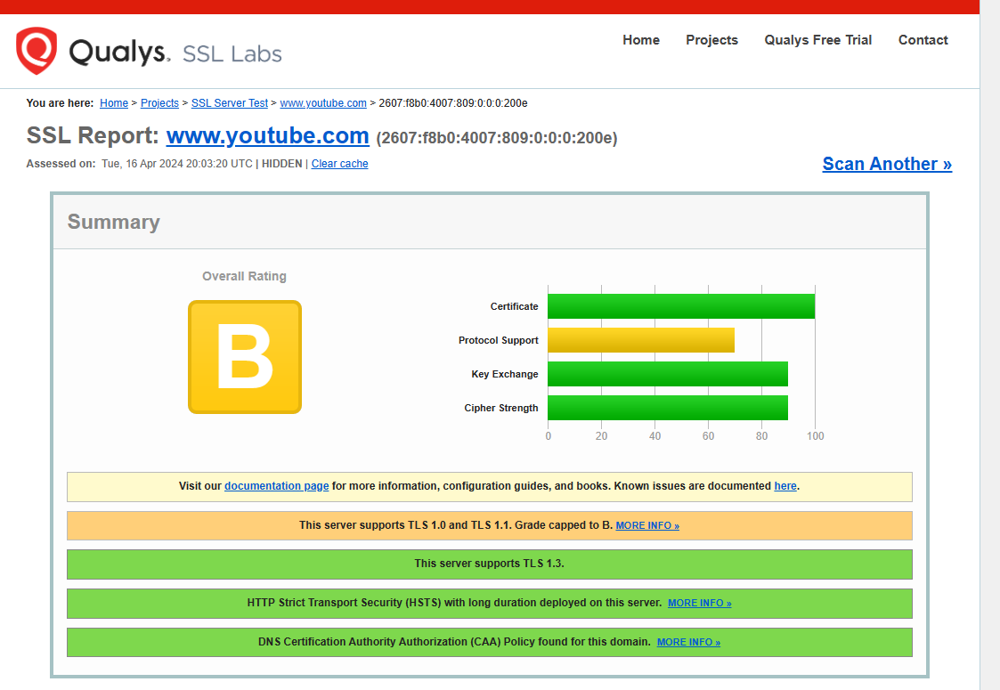
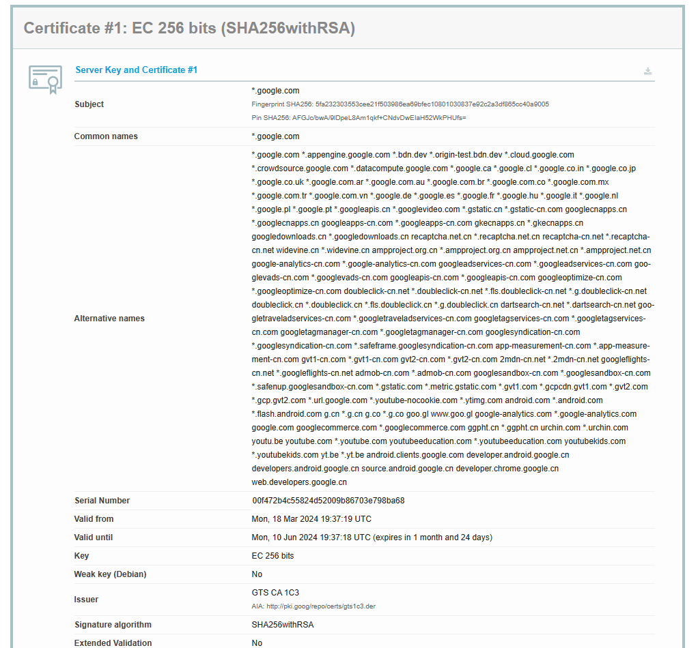
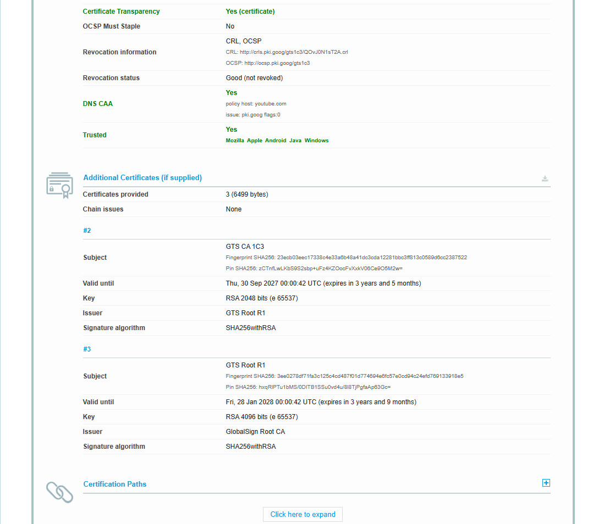
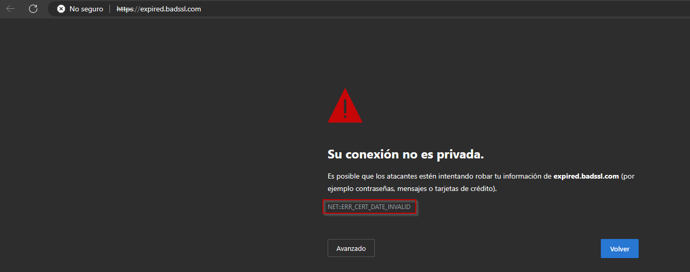
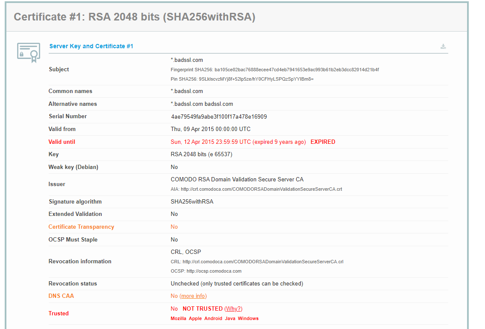
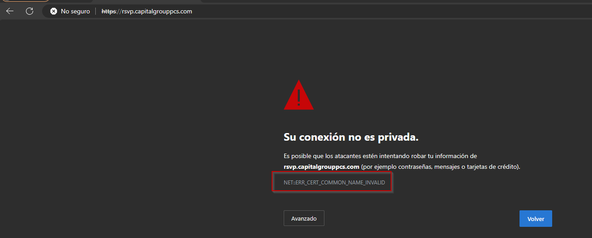
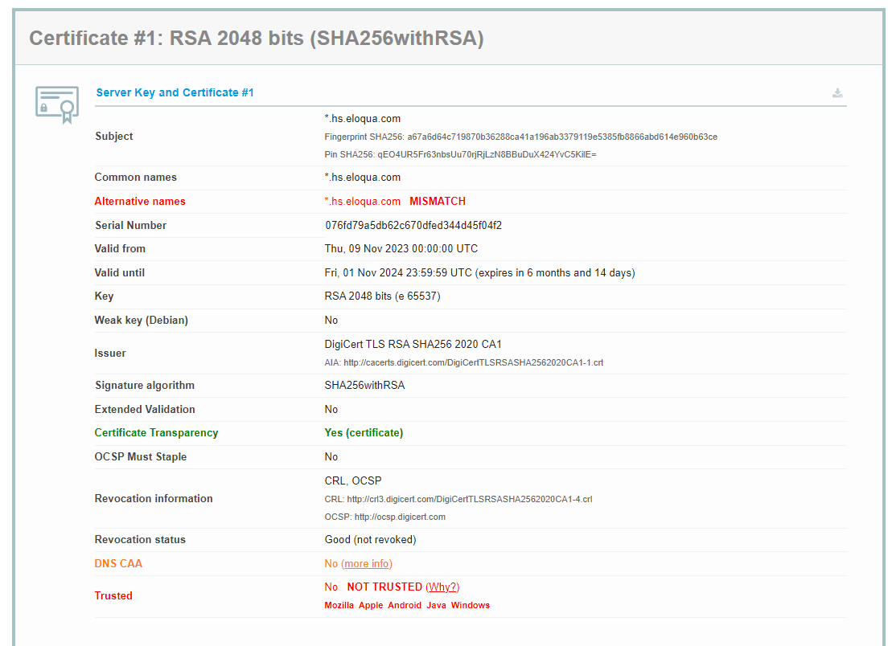
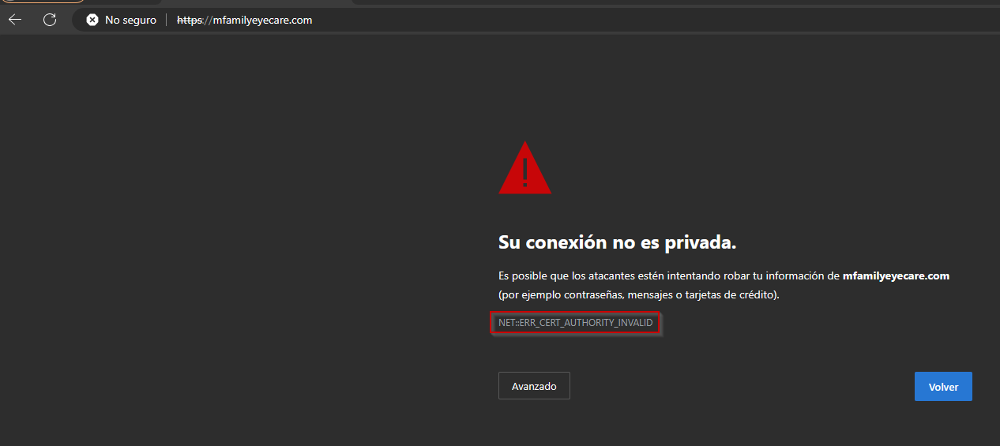
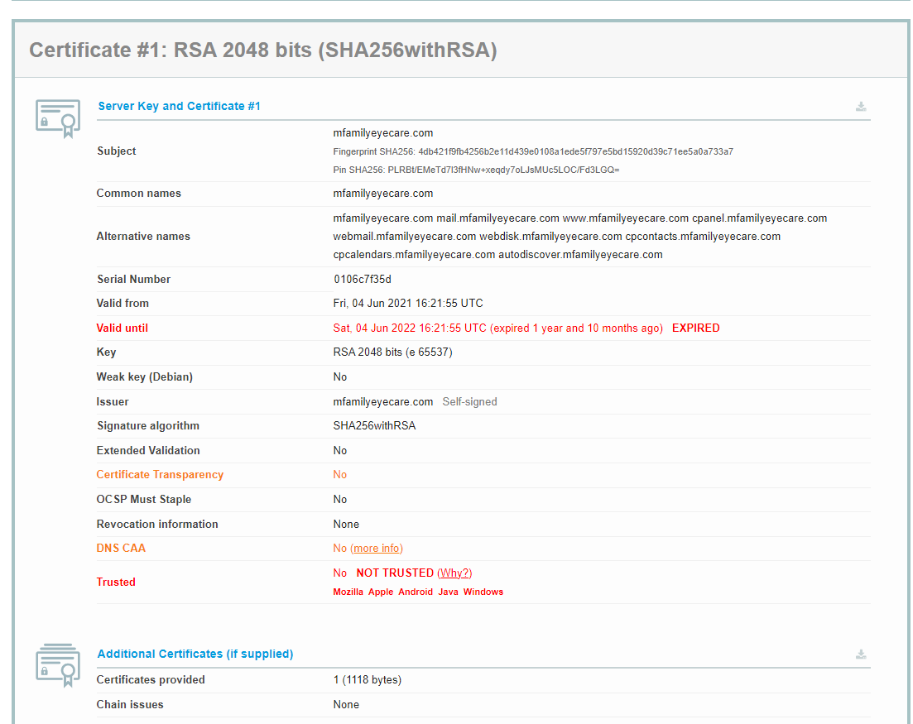

# Parte 3 Certificados digitales - Sergio Guerrero Merlo

## explicación de la verificación del certificado digital de Youtube

He utilizado la herramienta web SSL Labs con la URL de www.Youtube.com para comprobar la información del mismo.

Lo primero que nos muestra SSL Labs es un resumen del certificado con una nota teniendo en cuenta como valores el certificado, el protocolo soportado, el intercambio de claves y la fuerza del cifrado.

Comprobando el certificado, contiene una serie un subject que contiene el nombre común de la jerarquía del certificado vista en la parte 2 y el cifrado del propio certificado.

En alternative names tenemos todos los distintos nombres de dominio que están bajo esta jerarquía de certificados.

Contiene un número de serie para identificar al certificado de manera única.

Pero lo más importante que podemos ver en esta captura y que válida el certificado es el Issuer ya que muestra la información de la entidad que verificó y firmó el certificado.

Podemos ver que el certificado contiene unregistro DNS CAA que es el registro que indica que el certificado tiene la autorización de la autoridad de certificación y que el propio certificado ha sido admitido como seguro por parte de Mozilla, Apple, Android, Java y Windows.

Además vemos que hay una serie de certificados adicionales de la entidad que verifica y firma el certificado en cuestion.

Estos certificados están firmados por otras entidades certificadores como son GTS CA 1C3 y GTS Root R1.

## Tres certificados erróneos de diferentes tipos

El primer certificado a analizar es un certificado no válido por la expiración del mismo, dando el mensaje de error NET::ERR_CERT_DATE_INVALID.

Como podemos ver en la captura, no es válido ya que la fecha de caducidad es en 2019.

El segundo certificado no válido porque no coincide el nombre común dando el mensaje de error NET::ERR_CERT_COMMON_NAME_INVALID.

Como vemos en la imagen el nombre común no tiene nada que ver con el nombre que podemos ver en la URL de la captura de arriba.

El tercer y último certificado es no válido ya que no es posible cargar su certificado dando el error NET::ERR_CERT_AUTHORITY_INVALID.

Como podemos ver en la siguiente captura, además de estar expirado, el certificado no es transparente y es autofirmado.
